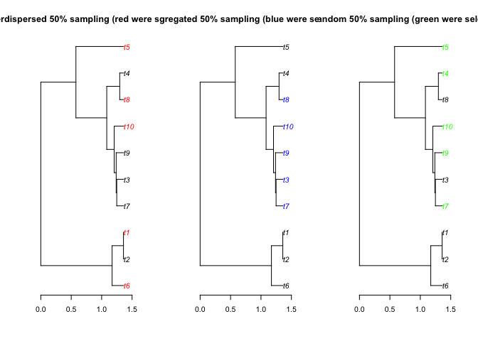
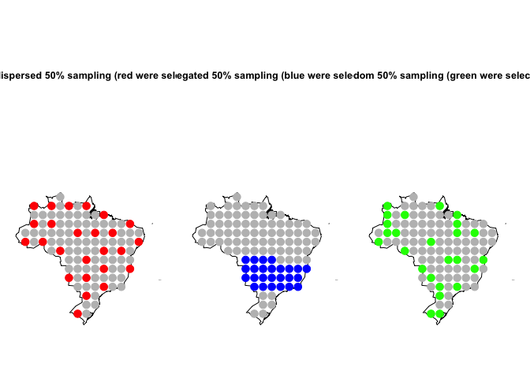
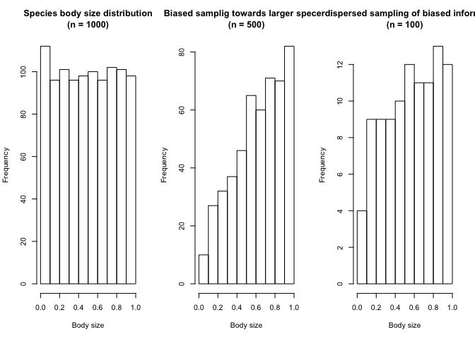

# About

sampler is an R package that provides functions to generate overdispersed and aggregated sampling designs in the geographic, phylogenetic or any trait/variables space.

# Install

```r
library(devtools)
install_github('BrunoVilela/sampler', dependencies = TRUE)
```

# Examples 
Load it:

```r
library(sampler)
```

Phylogeny example:

```r
# Generate a random tree
require(ape)
```

```
## Loading required package: ape
```

```r
tree <- rcoal(10)
## Calculate the distance
dist <- cophenetic(tree)
## Highly overdispersed 50% resample design (alpha = 50)
selection <- run_sampler(x = dist, n = 5, alpha = 100, starting = "t10")
## Highly aggregated 50% resample design (alpha = -100)
selection2 <- run_sampler(x = dist, n = 5, alpha = -100, starting = "t10")
## Random 50% resample design (alpha = 0)
selection3 <- run_sampler(x = dist, n = 5, alpha = 0, starting = "t10")
## Plot to compare
par(mfrow = c(1, 3))
plot(tree,tip.color=ifelse(tree$tip.label %in% selection, "red","black"),
 main = "Overdispersed 50% sampling (red were selected)", cex = 1)
 axis(1)
plot(tree,tip.color=ifelse(tree$tip.label %in% selection2, "blue","black"),
main = "Aggregated 50% sampling (blue were selected)", cex = 1)
axis(1)
plot(tree,tip.color=ifelse(tree$tip.label %in% selection3, "green","black"),
main = "Random 50% sampling (green were selected)", cex = 1)
axis(1)
```

<!-- -->


Geography example:

```r
require(sp)
```

```
## Loading required package: sp
```

```r
require(maptools)
```

```
## Loading required package: maptools
```

```
## Checking rgeos availability: FALSE
##  	Note: when rgeos is not available, polygon geometry 	computations in maptools depend on gpclib,
##  	which has a restricted licence. It is disabled by default;
##  	to enable gpclib, type gpclibPermit()
```

```r
require(fields)
```

```
## Loading required package: fields
```

```
## Loading required package: spam
```

```
## Loading required package: grid
```

```
## Spam version 1.4-0 (2016-08-29) is loaded.
## Type 'help( Spam)' or 'demo( spam)' for a short introduction 
## and overview of this package.
## Help for individual functions is also obtained by adding the
## suffix '.spam' to the function name, e.g. 'help( chol.spam)'.
```

```
## 
## Attaching package: 'spam'
```

```
## The following objects are masked from 'package:base':
## 
##     backsolve, forwardsolve
```

```
## Loading required package: maps
```

```r
data(wrld_simpl)  # World map
Brazil <- wrld_simpl[wrld_simpl$NAME == "Brazil", ]  # Brazil (polygon)
coords <- slot(spsample(Brazil, 100, "regular"), "coords")
rownames(coords) <- paste0("t", 1:nrow(coords))
## Calculate the geographic distance
dist.geo <- rdist.earth(coords)
## Subsample 50%
### Overdispersed
selection.geo <- run_sampler(x = dist.geo, n = 25, alpha = 100, starting = "t10")
### Aggregated
selection.geo2 <- run_sampler(x = dist.geo, n = 25, alpha = -100, starting = "t10")
### Random
selection.geo3 <- run_sampler(x = dist.geo, n = 25, alpha = 0, starting = "t10")

## Plot
par(mfrow = c(1, 3), mar = c(1, 1, 15, 1))
plot(Brazil, main = "Overdispersed 50% sampling (red were selected)")
points(coords, cex = 2, pch = 19,
col = ifelse(rownames(coords) %in% selection.geo, "red","gray"))
plot(Brazil, main = "Aggregated 50% sampling (blue were selected)")
points(coords, cex = 2, pch = 19,
col = ifelse(rownames(coords) %in% selection.geo2, "blue","gray"))
plot(Brazil, main = "Random 50% sampling (green were selected)")
points(coords, cex = 2, pch = 19,
col = ifelse(rownames(coords) %in% selection.geo3, "green","gray"))
```

<!-- -->


Trait example:

```r
## Fake body size
set.seed <- 1
body_size <- runif(1000)
# Biased sample towards large species
set.seed <- 1
body_size_bias <- sample(body_size, 500, prob = body_size)
par(mfrow = c(1, 3))
hist(body_size, main = "Species body size distribution\n(n = 1000)",  xlab = "Body size")
hist(body_size_bias, main = "Biased samplig towards larger species\n(n = 500)",
xlab = "Body size")
# Use sampler to reduce the bias
dist_bs <- as.matrix(dist(body_size_bias))
rownames(dist_bs) <- colnames(dist_bs) <- 1:length(body_size_bias)
selection.bs <- run_sampler(x = dist_bs, n = 100, alpha = 100)
hist(body_size_bias[as.numeric(selection.bs)],
 main = "Overdispersed sampling of biased information \n(n = 100)",
 xlab = "Body size")
```

<!-- -->

